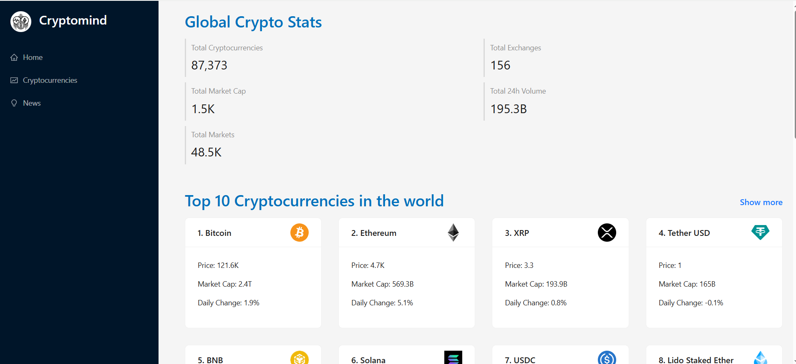
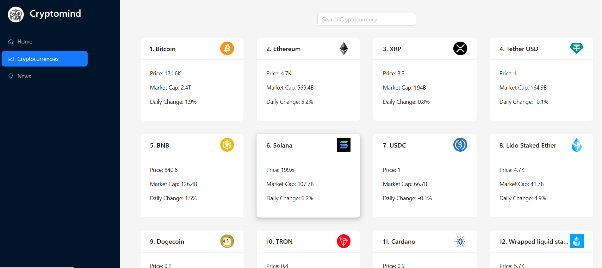
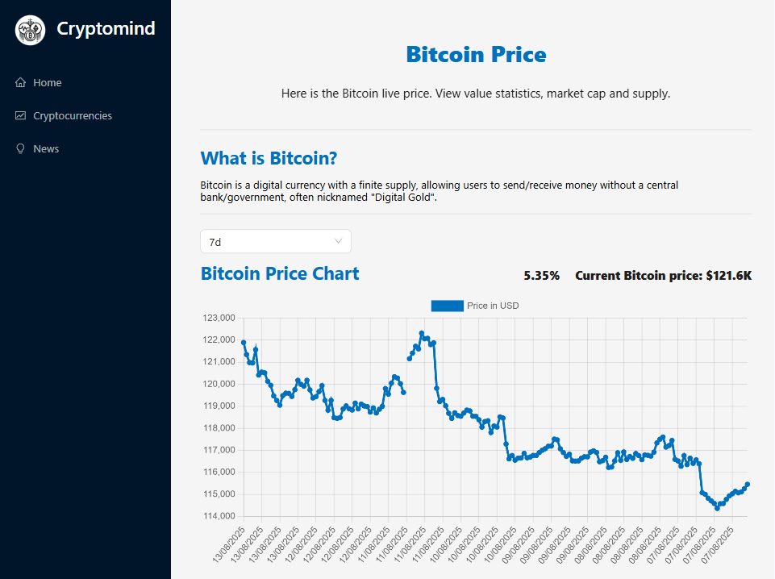
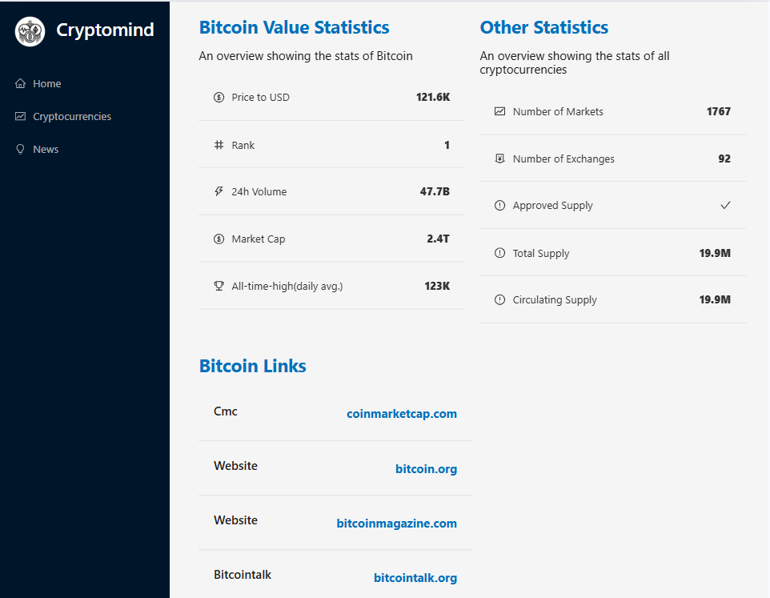
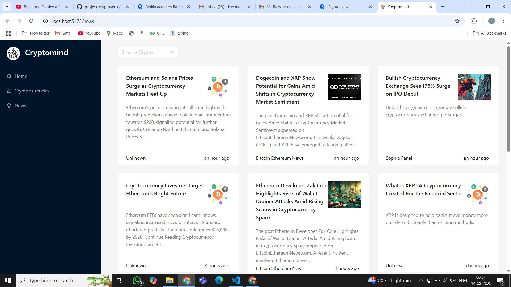
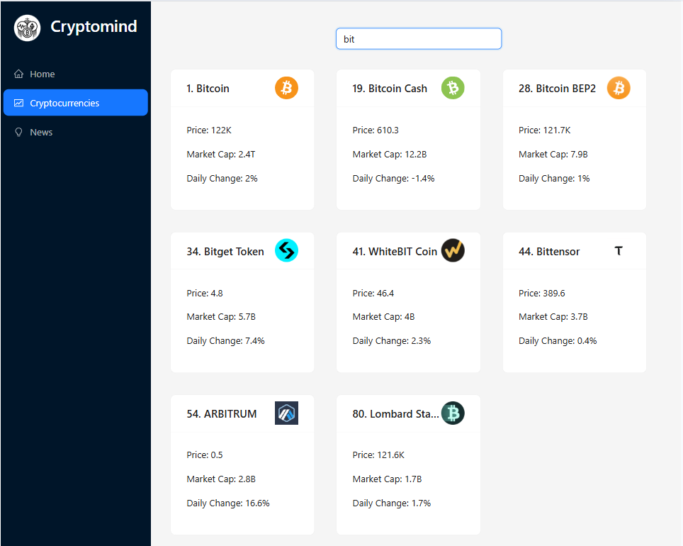
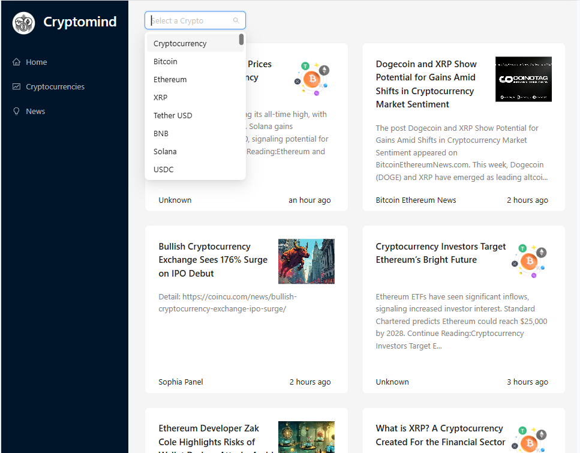
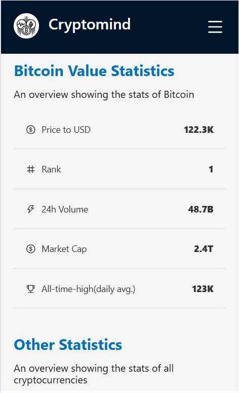
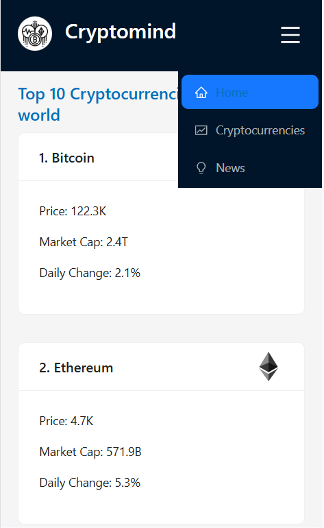

# 📈 Cryptomind

Cryptomind is a **React-based cryptocurrency tracking application** that provides **real-time market data**, **detailed coin statistics**, **price charts**, and **latest news** for cryptocurrencies.  
It uses **Coinranking API** for market data and **Crypto News API** for news updates.  

---

## 🚀 Features

- 🌍 **Global Crypto Stats** – View total cryptocurrencies, market cap, exchanges, markets, and 24h volume.
- 💰 **Top Cryptocurrencies** – Display coins with search functionality.
- 📊 **Detailed Coin Info** – Price history charts, market stats, supply info, and official links.
- 📰 **Latest Crypto News** – Get crypto-related news from multiple sources with filters.
- 📱 **Responsive Design** – Fully responsive layout with mobile-friendly navigation.

---

## 🛠️ Tech Stack

- **Frontend**: React, React Router, Ant Design, Chart.js
- **State Management**: Redux Toolkit, RTK Query
- **API Data**: Coinranking API, Crypto News API (via RapidAPI)
- **Utilities**: millify, moment.js

---

## 📂 Folder Structure
```markdown
cryptomind/
│── src/
│ ├── components/
│ │ ├── Navbar.jsx
│ │ ├── HomePage.jsx
│ │ ├── Cryptocurrencies.jsx
│ │ ├── CryptoDetails.jsx
│ │ ├── News.jsx
│ │ ├── LineChart.jsx
│ │ ├── Loader.jsx
│ │ ├── index.js
│ ├── services/
│ │ ├── cryptoApi.js
│ │ ├── cryptoNewsApi.js
│ ├── app/
│ │ ├── store.js
│ ├── images/
│ ├── App.jsx
│ ├── App.css
│── public/
│── package.json
│── README.md

```

---

## 🔑 API Setup

This project uses **RapidAPI** to fetch crypto data and news.

1. Create an account at [RapidAPI](https://rapidapi.com/).
2. Subscribe to:
   - **Coinranking API**
   - **Crypto News API**
3. Get your **API Key**.
4. Create a `.env` file in your project root:

```env
VITE_RAPIDAPI_KEY=your_api_key_here
```

### ⚡ Installation & Running

Clone the repository
```bash
git clone https://github.com/Kavana-navada/Cryptomind.git
cd cryptomind
```

Install dependencies
```bash
npm install
```

Run the development server
```bash
npm run dev
```

Build for production
```bash
npm run build
```

---

📸 Screenshots

Home Page


CryptoCurrencies Page


Coin Details




News Page


Search coins or news
<div>

   &nbsp; &nbsp; &nbsp; &nbsp;

</div>
Reponsiveness
<div>

  &nbsp; &nbsp; &nbsp; &nbsp;

</div>


---

If you want, I can also **add detailed usage instructions with GIFs showing navigation between pages** so your README looks more professional and engaging. That would make it stand out on GitHub.

